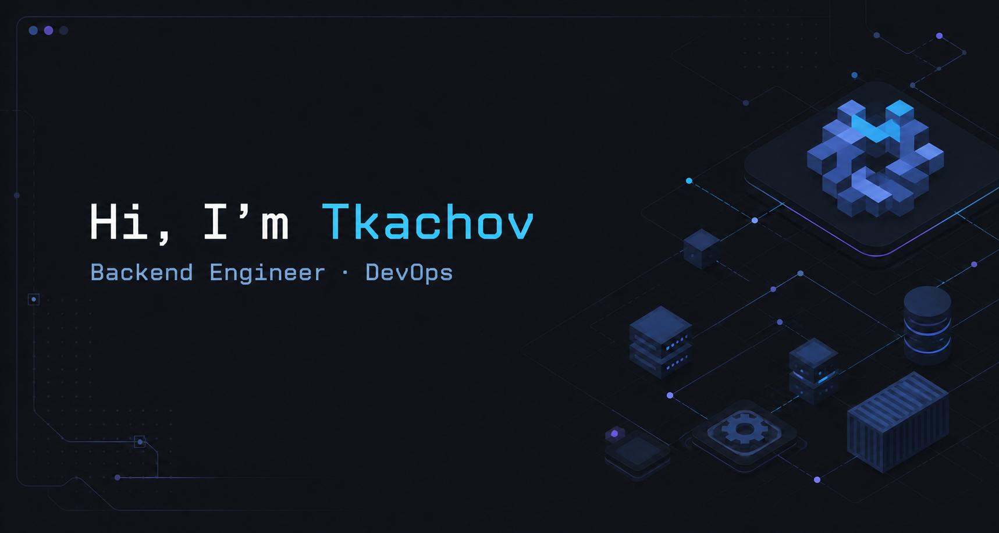

<div align="center">



</div>

```console
tkachov@github:~$ location
Wrocław, Poland

tkachov@github:~$ focus
Building reliable backends and reproducible infrastructure
```

<div align="center">

<a href="mailto:dtkachov.work@gmail.com"></a>&nbsp;&nbsp;
<a href="https://www.linkedin.com/in/dima-tkachov"></a>

</div>

## About me

- 🔭 Leading backend development and Node.js architecture at **Codica**
- ☁️ Exploring infrastructure, automation, and cloud-native tooling
- 🐧 Daily-driving **NixOS** — declarative everything
- 🦀 Exploring **Rust** and **Go** at my own pace

<div align="center">

## Random dev thought

<a href="https://github.com/piyushsuthar/github-readme-quotes">
  
</a>

</div>

## Stack

<div align="center">

**Development**<br>
&nbsp;&nbsp;
&nbsp;&nbsp;
&nbsp;&nbsp;
&nbsp;&nbsp;
&nbsp;&nbsp;


**Exploring**<br>
&nbsp;&nbsp;


**Cloud & delivery**<br>
&nbsp;&nbsp;
&nbsp;&nbsp;
&nbsp;&nbsp;
&nbsp;&nbsp;
&nbsp;&nbsp;
&nbsp;&nbsp;
&nbsp;&nbsp;


**Systems**<br>
&nbsp;&nbsp;


**Data & observability**<br>
&nbsp;&nbsp;
&nbsp;&nbsp;
&nbsp;&nbsp;
&nbsp;&nbsp;


</div>

## GitHub dashboard

<div align="center">

<picture>
  <source media="(prefers-color-scheme: dark)" srcset="https://github-stats-extended.vercel.app/api?username=TkachovDmitriy&show_icons=true&rank_icon=github&hide_border=true&bg_color=0D1117&title_color=BB9AF7&text_color=C9D1D9&icon_color=9D7CD8">
  <source media="(prefers-color-scheme: light)" srcset="https://github-stats-extended.vercel.app/api?username=TkachovDmitriy&show_icons=true&rank_icon=github&hide_border=true&bg_color=FFFFFF&title_color=7C3AED&text_color=24292F&icon_color=8B5CF6">
  
</picture>
<picture>
  <source media="(prefers-color-scheme: dark)" srcset="https://github-stats-extended.vercel.app/api/top-langs?username=TkachovDmitriy&layout=compact&langs_count=8&card_width=420&hide_border=true&bg_color=0D1117&title_color=BB9AF7&text_color=C9D1D9">
  <source media="(prefers-color-scheme: light)" srcset="https://github-stats-extended.vercel.app/api/top-langs?username=TkachovDmitriy&layout=compact&langs_count=8&card_width=420&hide_border=true&bg_color=FFFFFF&title_color=7C3AED&text_color=24292F">
  
</picture>

### Contribution arcade

<picture>
  <source media="(prefers-color-scheme: dark)" srcset="https://raw.githubusercontent.com/TkachovDmitriy/TkachovDmitriy/contribution-output/contribution-graph-dark.svg">
  <source media="(prefers-color-scheme: light)" srcset="https://raw.githubusercontent.com/TkachovDmitriy/TkachovDmitriy/contribution-output/contribution-graph.svg">
  
</picture>

### When I'm AFK


</div>
